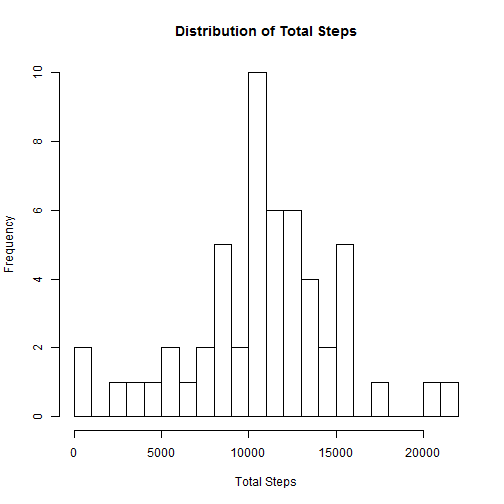
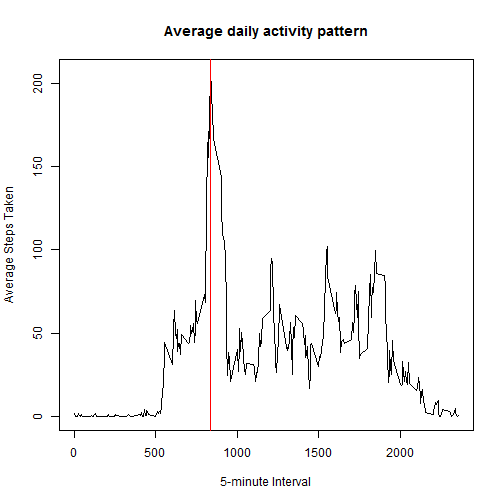
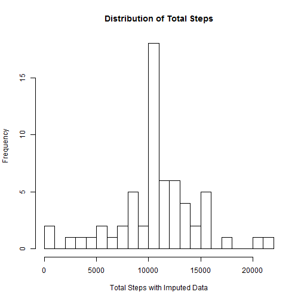
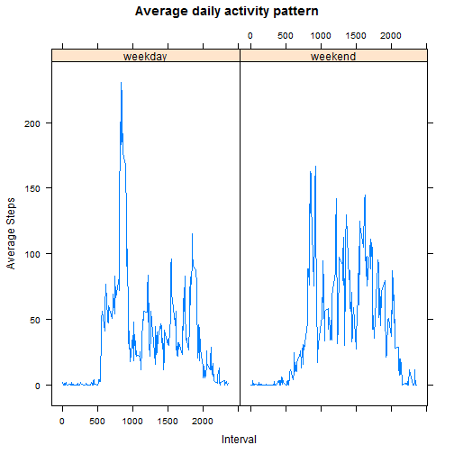

# Reproducible Research Assignment 1
##Author: Eric Solano


## 1. Loading and preprocessing the data

Transform the date variable to an R "Date" data type.  


```r
setwd("F:/001_KNOWLEDGE/R100_Sciences&Engineering/Math_Statistics_DataScience/DATA_SCIENCE_Coursera/Reproducible_Research/Assignment_1")
activity <- read.csv("data/activity.csv")

activity$date <- as.Date(as.character(activity$date), format = "%Y-%m-%d")

sapply(activity, class)
```

```
##     steps      date  interval 
## "integer"    "Date" "integer"
```


## 2. Mean total number of steps taken per day

The missing values were ignored by taking the complete cases.  
The total number of steps taken per day were calculated using the 'aggregate' function.  


```r
library(plyr)
activityc <- activity[complete.cases(activity),]
totalsteps <- aggregate(steps ~ date, data = activityc, sum)
hist(totalsteps$steps, breaks=20, main="Distribution of Total Steps", xlab="Total Steps")
```

 


The mean and median of the number of steps taken per day were calculated.  
A table summarizing the total, mean and median steps per day is presented below.  


```r
meansteps <-  aggregate(steps ~ date, data = activityc, mean)

table1 <- merge(totalsteps, meansteps, by=c("date"))
table1 <- rename(table1, c("steps.x"="total", "steps.y"="mean"))

mediansteps <-  aggregate(steps ~ date, data = activityc, median)
finaltable <- merge(table1, mediansteps, by=c("date"))
finaltable <- rename(finaltable, c("steps"="median"))

library(knitr)
kable(finaltable, digits = 2)
```


|date       | total|  mean| median|
|:----------|-----:|-----:|------:|
|2012-10-02 |   126|  0.44|      0|
|2012-10-03 | 11352| 39.42|      0|
|2012-10-04 | 12116| 42.07|      0|
|2012-10-05 | 13294| 46.16|      0|
|2012-10-06 | 15420| 53.54|      0|
|2012-10-07 | 11015| 38.25|      0|
|2012-10-09 | 12811| 44.48|      0|
|2012-10-10 |  9900| 34.38|      0|
|2012-10-11 | 10304| 35.78|      0|
|2012-10-12 | 17382| 60.35|      0|
|2012-10-13 | 12426| 43.15|      0|
|2012-10-14 | 15098| 52.42|      0|
|2012-10-15 | 10139| 35.20|      0|
|2012-10-16 | 15084| 52.38|      0|
|2012-10-17 | 13452| 46.71|      0|
|2012-10-18 | 10056| 34.92|      0|
|2012-10-19 | 11829| 41.07|      0|
|2012-10-20 | 10395| 36.09|      0|
|2012-10-21 |  8821| 30.63|      0|
|2012-10-22 | 13460| 46.74|      0|
|2012-10-23 |  8918| 30.97|      0|
|2012-10-24 |  8355| 29.01|      0|
|2012-10-25 |  2492|  8.65|      0|
|2012-10-26 |  6778| 23.53|      0|
|2012-10-27 | 10119| 35.14|      0|
|2012-10-28 | 11458| 39.78|      0|
|2012-10-29 |  5018| 17.42|      0|
|2012-10-30 |  9819| 34.09|      0|
|2012-10-31 | 15414| 53.52|      0|
|2012-11-02 | 10600| 36.81|      0|
|2012-11-03 | 10571| 36.70|      0|
|2012-11-05 | 10439| 36.25|      0|
|2012-11-06 |  8334| 28.94|      0|
|2012-11-07 | 12883| 44.73|      0|
|2012-11-08 |  3219| 11.18|      0|
|2012-11-11 | 12608| 43.78|      0|
|2012-11-12 | 10765| 37.38|      0|
|2012-11-13 |  7336| 25.47|      0|
|2012-11-15 |    41|  0.14|      0|
|2012-11-16 |  5441| 18.89|      0|
|2012-11-17 | 14339| 49.79|      0|
|2012-11-18 | 15110| 52.47|      0|
|2012-11-19 |  8841| 30.70|      0|
|2012-11-20 |  4472| 15.53|      0|
|2012-11-21 | 12787| 44.40|      0|
|2012-11-22 | 20427| 70.93|      0|
|2012-11-23 | 21194| 73.59|      0|
|2012-11-24 | 14478| 50.27|      0|
|2012-11-25 | 11834| 41.09|      0|
|2012-11-26 | 11162| 38.76|      0|
|2012-11-27 | 13646| 47.38|      0|
|2012-11-28 | 10183| 35.36|      0|
|2012-11-29 |  7047| 24.47|      0|


## 3. Average daily activity pattern

The average number of steps taken for each 5-minute interval, averaged across all days, was calculated.  
The time series plot shows the Average daily activity pattern.  


```r
intervalavg <- aggregate(steps~interval, data = activityc, mean)
maxinterv <- intervalavg[which.max(intervalavg$steps),]

plot(intervalavg$interval, intervalavg$steps, type="l", main="Average daily activity pattern",
                             xlab="5-minute Interval", ylab="Average Steps Taken")
abline(v=maxinterv$interval, col="red")
```

 

The interval with the maximum number of steps is interval: 835 with 206.2 steps in average.


## 4. Imputing missing values

The total number of missing values in the dataset was calculated by using the 'is.na' function.  


```r
nmiss <- activity[is.na(activity),]
```

A total of 2304 rows have missing values.
A missing number-of-steps value will be replaced with the average value for that specific 5-minute interval. 
A new dataset was created containing the imputed values.


```r
activity$steps2 <- activity$steps
for (i in 1:nrow(activity)){
      if (is.na(activity[i,]$steps)){
              activity[i,]$steps2 <- intervalavg[which(intervalavg$interval==activity[i,]$interval),]$steps
      }
}
```


A histogram of the total number of steps taken each day was created with the new dataset.  
The mean and median total number of steps taken per day were calculated with the new dataset.  
These values differ from the estimates from the first part of the assignment.  
When imputing missing data on the estimates of the total daily number of steps,  


```r
totalsteps2 <- aggregate(steps2 ~ date, data = activity, sum)
hist(totalsteps2$steps2, breaks=20, main="Distribution of Total Steps", xlab="Total Steps with Imputed Data")
```

 

```r
meansteps2 <-  aggregate(steps2 ~ date, data = activity, mean)

table2 <- merge(totalsteps2, meansteps2, by=c("date"))
table2 <- rename(table2, c("steps2.x"="total.imp", "steps2.y"="mean.imp"))

mediansteps2 <-  aggregate(steps2 ~ date, data = activity, median)
finaltable2 <- merge(table2, mediansteps2, by=c("date"))
finaltable2 <- rename(finaltable2, c("steps2"="median.imp"))

#mergedtables <- merge(finaltable, finaltable2, by=c("date"))

library(knitr)
kable(finaltable2, digits = 2)
```


|date       | total.imp| mean.imp| median.imp|
|:----------|---------:|--------:|----------:|
|2012-10-01 |  10766.19|    37.38|      34.11|
|2012-10-02 |    126.00|     0.44|       0.00|
|2012-10-03 |  11352.00|    39.42|       0.00|
|2012-10-04 |  12116.00|    42.07|       0.00|
|2012-10-05 |  13294.00|    46.16|       0.00|
|2012-10-06 |  15420.00|    53.54|       0.00|
|2012-10-07 |  11015.00|    38.25|       0.00|
|2012-10-08 |  10766.19|    37.38|      34.11|
|2012-10-09 |  12811.00|    44.48|       0.00|
|2012-10-10 |   9900.00|    34.38|       0.00|
|2012-10-11 |  10304.00|    35.78|       0.00|
|2012-10-12 |  17382.00|    60.35|       0.00|
|2012-10-13 |  12426.00|    43.15|       0.00|
|2012-10-14 |  15098.00|    52.42|       0.00|
|2012-10-15 |  10139.00|    35.20|       0.00|
|2012-10-16 |  15084.00|    52.38|       0.00|
|2012-10-17 |  13452.00|    46.71|       0.00|
|2012-10-18 |  10056.00|    34.92|       0.00|
|2012-10-19 |  11829.00|    41.07|       0.00|
|2012-10-20 |  10395.00|    36.09|       0.00|
|2012-10-21 |   8821.00|    30.63|       0.00|
|2012-10-22 |  13460.00|    46.74|       0.00|
|2012-10-23 |   8918.00|    30.97|       0.00|
|2012-10-24 |   8355.00|    29.01|       0.00|
|2012-10-25 |   2492.00|     8.65|       0.00|
|2012-10-26 |   6778.00|    23.53|       0.00|
|2012-10-27 |  10119.00|    35.14|       0.00|
|2012-10-28 |  11458.00|    39.78|       0.00|
|2012-10-29 |   5018.00|    17.42|       0.00|
|2012-10-30 |   9819.00|    34.09|       0.00|
|2012-10-31 |  15414.00|    53.52|       0.00|
|2012-11-01 |  10766.19|    37.38|      34.11|
|2012-11-02 |  10600.00|    36.81|       0.00|
|2012-11-03 |  10571.00|    36.70|       0.00|
|2012-11-04 |  10766.19|    37.38|      34.11|
|2012-11-05 |  10439.00|    36.25|       0.00|
|2012-11-06 |   8334.00|    28.94|       0.00|
|2012-11-07 |  12883.00|    44.73|       0.00|
|2012-11-08 |   3219.00|    11.18|       0.00|
|2012-11-09 |  10766.19|    37.38|      34.11|
|2012-11-10 |  10766.19|    37.38|      34.11|
|2012-11-11 |  12608.00|    43.78|       0.00|
|2012-11-12 |  10765.00|    37.38|       0.00|
|2012-11-13 |   7336.00|    25.47|       0.00|
|2012-11-14 |  10766.19|    37.38|      34.11|
|2012-11-15 |     41.00|     0.14|       0.00|
|2012-11-16 |   5441.00|    18.89|       0.00|
|2012-11-17 |  14339.00|    49.79|       0.00|
|2012-11-18 |  15110.00|    52.47|       0.00|
|2012-11-19 |   8841.00|    30.70|       0.00|
|2012-11-20 |   4472.00|    15.53|       0.00|
|2012-11-21 |  12787.00|    44.40|       0.00|
|2012-11-22 |  20427.00|    70.93|       0.00|
|2012-11-23 |  21194.00|    73.59|       0.00|
|2012-11-24 |  14478.00|    50.27|       0.00|
|2012-11-25 |  11834.00|    41.09|       0.00|
|2012-11-26 |  11162.00|    38.76|       0.00|
|2012-11-27 |  13646.00|    47.38|       0.00|
|2012-11-28 |  10183.00|    35.36|       0.00|
|2012-11-29 |   7047.00|    24.47|       0.00|
|2012-11-30 |  10766.19|    37.38|      34.11|

The values shown on the table above do not differ from the values in Section 2.  
The reason for this is that the missing values were missing for entire days, in other words when a day had data, it had data for the entire day.  


## 5. Differences in activity patterns between weekdays and weekends

A new factor variable was created in the dataset indicating "weekday" or "weekend".  


```r
weekend <- c("Saturday", "Sunday")

activity$dayname <- weekdays(activity$date)
activity$daytype <- "weekday"

for (i in 1:nrow(activity)){
      if (activity[i,]$dayname %in% weekend){
              activity[i,]$daytype <- "weekend"
      }
}

activity$daytype <- as.factor(activity$daytype)

intervalavg2 <- aggregate(steps2~interval+daytype, data = activity, mean)


library(lattice) 
xyplot(steps2~interval|daytype,
   data=intervalavg2, type="l", main="Average daily activity pattern", xlab="Interval", ylab="Average Steps")
```

 

From the plots, it seems that this person had two different activity patterns during the weekend versus the weekdays. 

